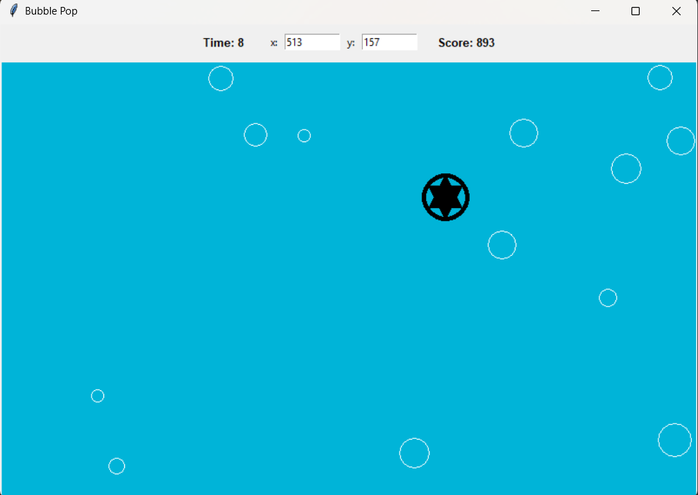
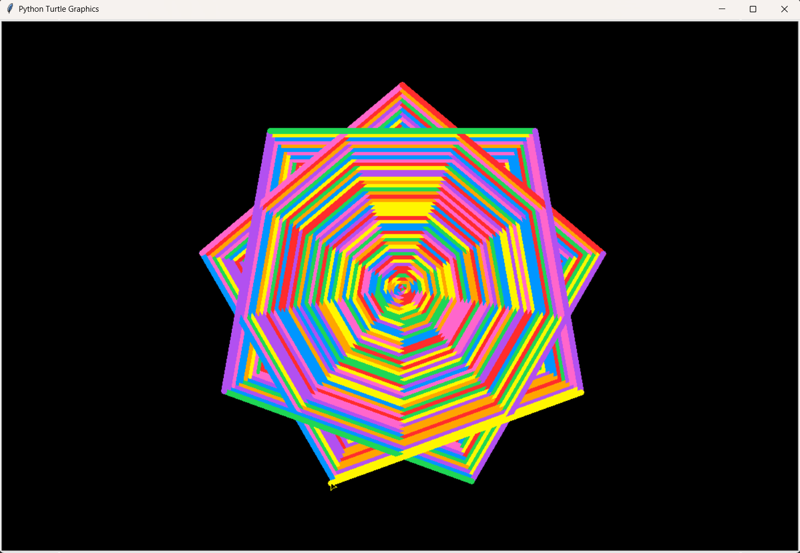
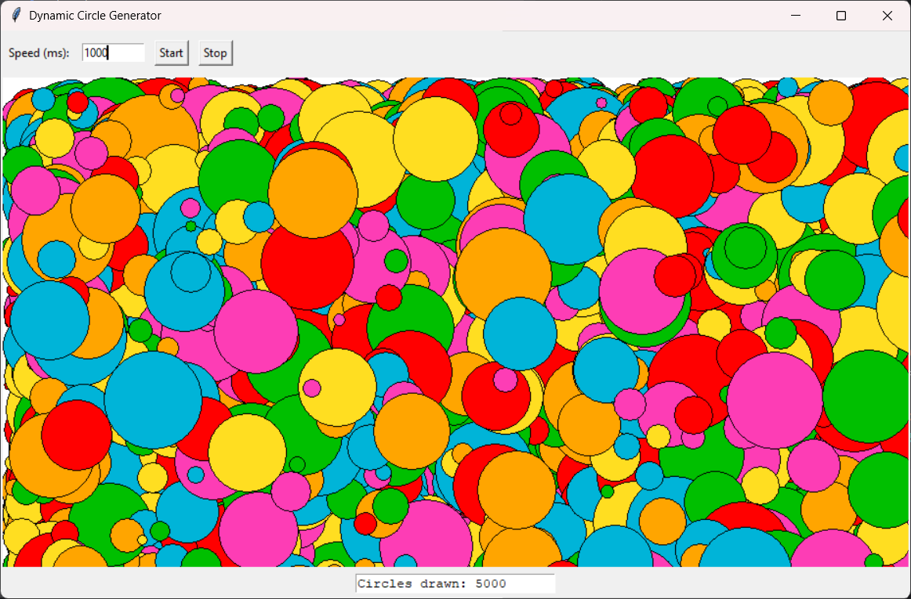

# Bubble Pop Project
This project after launching opens a window with a circular shape which will follow your mouse.
Your goal is to pop the bubbles flying from the right by touching them by the shape.

The bubbles will add to your score on top a bit to the right.
On the left you will see the time left, some popped bubbles will increase it, when it runs out, the game ends.
On the middle top are the coordinates of the shape.

---

# Turtle Loop
It is a simple program that uses Tkinter for creating a window and Turtle for drawing lines.
The loop random picks a color from the given list, increases the length of the lines drawn by 1 and rotates its direction by 119° (for triangular shape).
You can play with the values inside the code where the comments are.

---

# Circle Overlay
It generates at random positions randomly sized circles filled with random color. That is pretty much it.
You can change the generating speed on the top left of the window (the number is the delay in milliseconds).
Than there are the start and stop buttons. On the bottom, there is the total number of circles generated.
